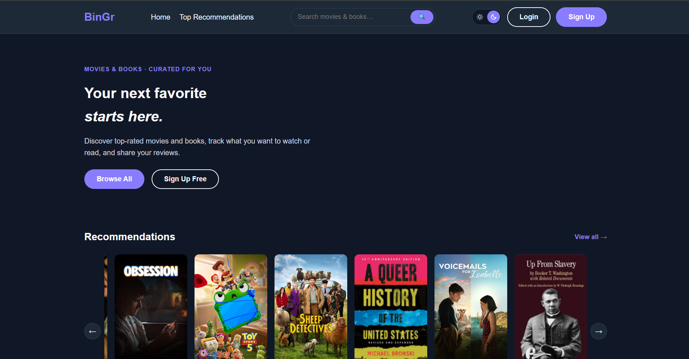

# Bingr

A Flask web application that recommends **movies and books** based on your taste. It combines a content-based machine-learning book recommender, a precomputed movie similarity engine, and live data from the TMDB and Google Books APIs. Users can create an account, search and track what they have read or watched, save items to a wishlist, leave reviews, and receive personalized recommendations that improve as they interact with the app.

> Built as a 4-person team project for an Intro Software Engineering course (COMP 380) at CSUN.

## Features

- Secure user accounts with login, logout, and password reset
- Search movies and books by title or author
- Rate, review, and track content you have read or watched
- Save items to a personal wishlist
- Personalized recommendations that adapt from a cold start to a full profile as you interact
- Light and dark mode

## Tech Stack

- **Backend:** Python, Flask (application-factory pattern + blueprints)
- **Database:** SQLAlchemy ORM, SQLite
- **Auth:** Flask-Login, Flask-Bcrypt, itsdangerous (signed reset tokens)
- **Recommendations:** scikit-learn (TF-IDF + cosine similarity), pandas, NumPy
- **External APIs:** TMDB (movies), Google Books (books)
- **Caching:** Flask-Caching

## How the Recommendations Work

- **Books** — content-based filtering. Each book is represented as a TF-IDF vector over its genres, author, and description. Recommendations rank books by cosine similarity to a weighted profile built from your interactions, blended with a quality score so results stay both relevant and reputable.
- **Movies** — a cosine-similarity matrix is precomputed offline. Your recommendations are the highest-scoring movies that sit closest to everything you have liked.

## Run Locally

Requires **Python 3.10+** and free API keys from [TMDB](https://www.themoviedb.org/settings/api) and [Google Books](https://console.cloud.google.com/).

```bash
git clone https://github.com/kelvinj02/Bingr.git
cd Bingr
python -m venv .venv
source .venv/bin/activate      # Windows: .venv\Scripts\activate
pip install -r requirements.txt
```

Create a `.env` file in the project root:

```
SECRET_KEY=your-secret-key
TMDB_API_KEY=your-tmdb-key
BOOKS_API_KEY=your-google-books-key
MAIL_USERNAME=your-email@gmail.com
MAIL_PASSWORD=your-app-password
```

Then start the server:

```bash
python run.py
```

Open http://127.0.0.1:5000 in your browser, sign up, and after a few interactions the recommendations switch from cold-start to a full personalized profile.

## Screenshots



## Future Work

- Resolve slow first-load when the server cache is cold
- Social features (following other users, an activity feed, liking reviews)
- Filters by genre, year, and rating
- TV-show tracking and recommendations
